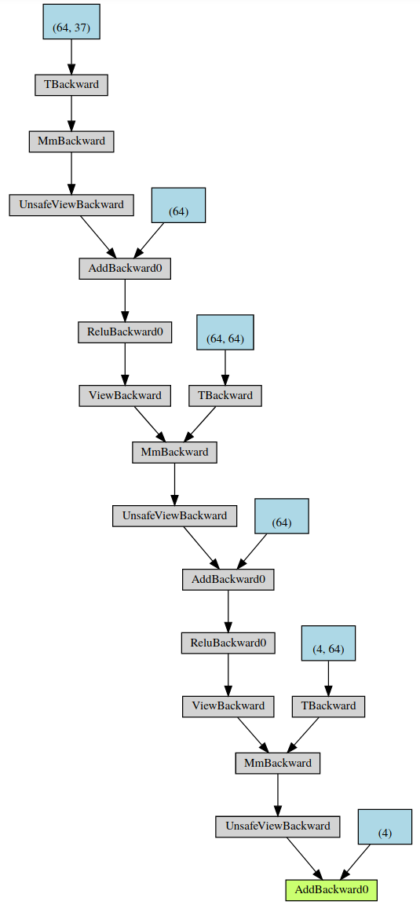

# Reinforcement Learning Basics

## What is Reinforcement Learning?
Reinforcement Learning is one of the three basic machine learning paradigms. The other paradigms are supervised learning (classification and regression) and unsupervised learning (clustering).

Reinforcement learning is the only paradigm that does not require a data set in advance. Instead, an agent learns from trial and error to take suitable actions to maximize the cumulative reward.

At first, the agent observes the environment state and chooses an action. At the next time step, as a consequence of the agents action, the environment transitions and gives some reward to the agent. Then the agent can choose an action again etc. The goal of the agent is to maximize expected cumulative reward.

<figure class="image">
  
  <figcaption>source: Udacity</figcaption>
</figure>

There are two types of tasks: Episodic tasks have a well-defined starting and ending point. Continuing tasks are tasks without end.

## How to solve a Reinforcement Learning Task?
A reinforcement learning task is a Markov Decision Process (MDP). If consists of:
 * a set of possible actions, referred to as **action space**
 * a set of possible states, called **state space**
 * **one-step dynamics**, defined by transition probabilities
 * **reward probabilities**

The agent determines the action according to a **policy** . A deterministic policy is a mapping from the set of environment states to the set of possible actions. A stochastic policy takes an environment state and an action and returns the probability that the agent chooses that action.

Since rewards which come sooner are more predictable, they are usually valued more highly. To do this, future reward is multiplied by a discount rate  with . For a time step  the return is . This concept is called **discounted return**.

Each state can have a value which corresponds to the expected return when starting in that state and choosing actions according to the policy .
The value of any state is expressed by the **Bellman Expectation Equation**:<br/>
 *(state-value function for policy )*


Each state-action pair can have a value which corresponds to the expected return starting in that state, taking that action and thereafter choosing actions according to the policy :<br/>
 ( **Action-Value Function**)

**Summary:** Based on the agent's interaction with the environment, it estimates the optimal action-value function. From this function it can derive the optimal policy by choosing .

## A Taxonomy of RL Algorithms
<figure class="image">
  
  <figcaption>A non-exhaustive taxonomy of RL algorithms. Source: "Introduction to Reinforcement Learning" by J. Zico Kolter, Carnegie Mellon University</figcaption>
</figure>

<figure class="image">
  
  <figcaption>A non-exhaustive taxonomy of RL algorithms. Source: https://spinningup.openai.com/en/latest/spinningup/rl_intro2.html</figcaption>
</figure>

<figure class="image">
  
  <figcaption>Comparison of RL algorithms. Source:https://towardsdatascience.com/introduction-to-various-reinforcement-learning-algorithms-part-ii-trpo-ppo-87f2c5919bb9</figcaption>
</figure>

### Model-based Learning vs. Model-free Learning
Model-based learning methods such as Dynamic Programming require a known transition and reward model.

In contrast, model-free learning methods perform exploratory actions and use the experience gained to directly estimate value functions. Examples are Monte Carlo Methods and Temporal Difference Methods.

### Monte Carlo Methods
#### Prediction Problem
> Given a policy, how might the agent estimate the value function for that policy?

Many episodes are generated in which the agent chooses random actions (equiprobable random policy). At the end of each episode the state-action pairs are saved.

#### Control Problem
> Estimate the optimal policy.

The optimal policy can be estimated by calculating the difference between the most recent return and the corresponding state-action pair. The resulting value serves as an error term and is multiplied by a constant- with .

Instead of always using the equiprobable random policy, an -greedy policy derived from the most recent state-action pairs can be used.

<figure class="image">
  
  <figcaption>source: Udacity</figcaption>
</figure>

To overcome the exploration vs. exploitation dilemma, the value of  can gradually decay over time (Greedy in the Limit with Infinite Exploration / GLIE).

### Temporal Difference Methods
In contrast to MC Control, TD Control updates the value function after every time step and is therefore also applicable for continuing tasks. TD Control calculates the difference between this target and the currently predicted Q value. This difference is referred to as the TD error. The goal is to reduce this error and find the true value function .

There are multiple algorithms:
#### Sarsa(0) / Sarsa
Sarsa is an on-policy TD control method. After every action the agent updates the corresponding action-value pair based on the sum of the immediate reward and the discounted value of the next state-action pair.

#### Sarsamax / Q-Learning
Sarsamax is an off-policy TD control method. The update step is one step earlier as in the Sarsa(0) algorithm - after receiving the reward and the next state. In Sarsa, the action-value pair which corresponds to the executed action is updated. In Sarsamax, the action-value pair which corresponds to the action of the greedy policy is updated.

#### Expected Sarsa
Expected Sarsa is an on-policy TD control method. It differs from Sarsamax in the update step of the action values. It takes into account the probability that the agent chooses each possible action from the next state.

## Value-Based RL Algorithms
### Deep Q-Learning
A variant of Q-Learning is Deep Q-Learning. The idea of Deep Q-Learning is to use a deep neural network to approximate the optimal action-value function. This network outputs a vector of action values based directly on observations from the environment. The agent can choose the action with the maximum value, for example.

In contrast to MC Control or TD Control where only one Q value is calculated at a time, with Deep Q-Learning a Q value for every possible action can be produced in one forward pass.

#### Replay Buffer and Experience Replay
A sequence of experience tuples is often highly correlated which can lead to oscillating or diverging action values. To break correlations all experiences can be stored in a replay buffer.

The idea of experience replay is to sample a small batch of random tuples to learn. Experience replay also allows to recall experiences involving rare states or costly actions instead of wasting them.

#### Fixed Q-Targets
The Deep Q-Learning algorithm uses two separate networks with identical architectures. The primary network is updated in every step whereas the target network is updated only periodically, i.e. after a certain number of steps. This approach prevents from a a constantly moving target.

## Policy-Based RL Algorithms
An overview of policy-based algorithms can be found here: https://github.com/AnKra/udacity-deep-reinforcement-learning-continuous-control-project/blob/master/Report.md

# Project 1 - Navigation

## Learning Algorithm
The learning algorithm is based on the [DQN Paper](https://storage.googleapis.com/deepmind-media/dqn/DQNNaturePaper.pdf). I used experience replay to randomize the experience tuples. In addition, I update the target Q network only after a whole batch has been processed. I use a batch size of 64.

The agents chooses actions according to an -greedy policy. To address the exploration vs. exploitation dilemma,  is set to 1 at the beginning and then decays slowly by a factor of 0.9 to a value of 0.01. I consciously set the decay factor to a larger value than in the DQN exercise because it results in the agent achieving better scores in less episodes.

I use a learning rate of 0.0005. I tried higher learning rates without success.

## Model Architecture
The primary network and the target network have identical architectures.

The state is passed as input through two fully connected hidden layers, each with 64 nodes. The nodes use a ReLU activation function. Finally, there is an output layer with 4 nodes corresponding to the 4 possible actions.

```
QNetwork(
  (fc1): Linear(in_features=37, out_features=64, bias=True)
  (fc2): Linear(in_features=64, out_features=64, bias=True)
  (fc3): Linear(in_features=64, out_features=4, bias=True)
)
```
```
def forward(self, x):
    x = F.relu(self.fc1(x))
    x = F.relu(self.fc2(x))
    x = self.fc3(x)
    return x
```



## Result
The agent achieves an average score of 13 in less than 300 episodes.


## Ideas for Improvement
### Double DQN
In standard Q-Learning and DQN, the same values are used both to choose and to evaluate an action. As a consequence actions which are overestimated are more likely to be be chosen. This results in unstable training.

The idea of Double DQN is to decouple the action selection from the target Q value estimation by using two networks: The primary network to choose an action and the target network to estimate the target Q value of taking that action at the next state.

### Prioritized Experience Replay
Instead of sampling experience tuples uniformly from the replay memory, important experience tuples can be replayed more frequently.

### Dueling DQN (DDQN)
The idea of Dueling Networks is to use two streams: One stream estimates the state value function and the other stream estimates the advantage of each action. Both streams share some layers such as convolutional layers and then branch off with their own fully connected layers.
